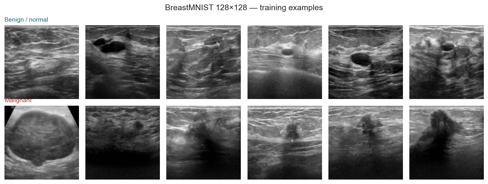
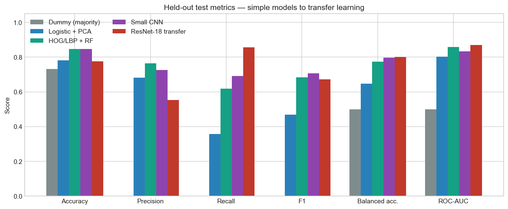
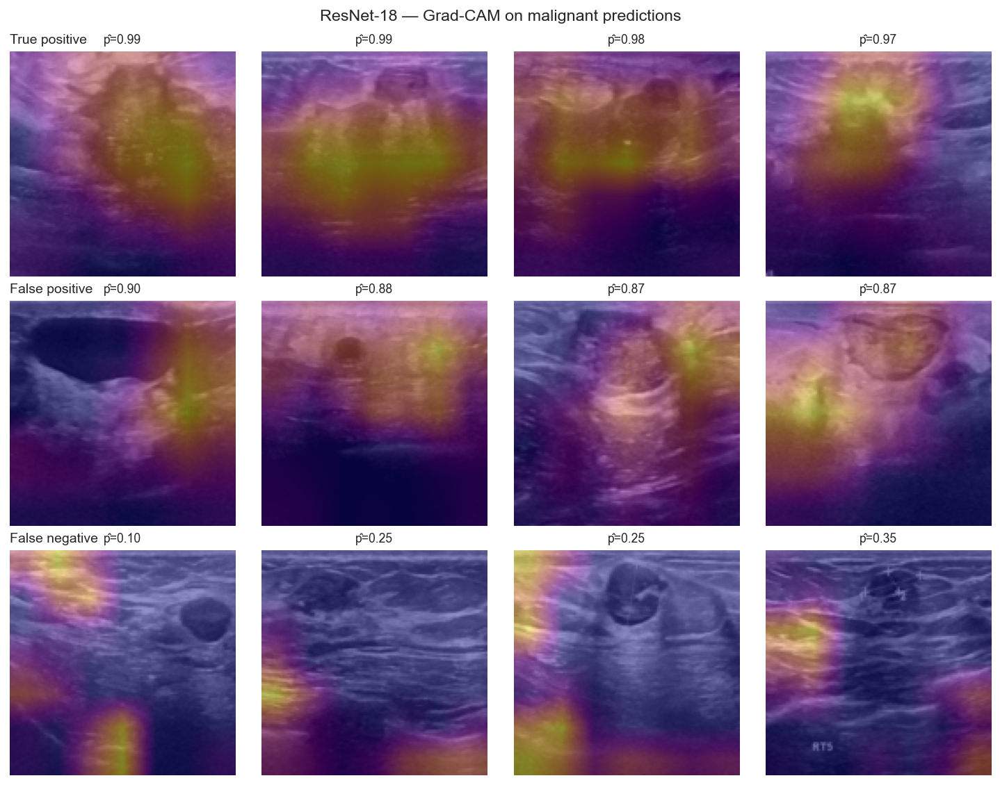

# Finding Cancer in Ultrasound Images

  <h2 style="color: white; margin-top: 0;">From pixel logistic regression to transfer learning</h2>
  
BreastMNIST ultrasound — metrics, trade-offs, and Grad-CAM explanations of what each model attends to

<strong>Not a medical device.</strong> This is an educational computer-vision case study on a public 128×128 benchmark. It is not validated for screening or diagnosis, and it should not be used to interpret clinical images.

## Project Overview

Radiologists reading breast ultrasound look for irregular hypoechoic masses, angular margins, and posterior acoustic shadowing. This project asks how far a sequence of machine-learning models can get on the same task — **malignant vs benign/normal** — when the images are the public [BreastMNIST](https://medmnist.com/) split of the BUSI ultrasound collection.

The modelling ladder is deliberate. A majority-class dummy sets the accuracy floor (never predicting cancer still scores ~73% because malignancy is the minority class). A linear model on PCA-reduced pixels is next, then classical computer-vision features (HOG and LBP) with a random forest, then a small CNN trained from scratch, and finally a frozen ImageNet ResNet-18 with a new classification head. Every model is scored on the **same official test set**, with decision thresholds chosen on the validation split.

The interesting part is not a single accuracy number. Precision, recall, specificity, ROC-AUC and PR-AUC move differently as the models get more expressive — and Grad-CAM overlays show whether the conv nets are looking at the mass or at a scan artefact.

## Project Structure

Five notebooks, from the images through to a held-out comparison dashboard:

  <h3 style="margin-top: 0; color: #0b3d4a;">1. Images &amp; Labels</h3>
  
<strong><a href="01_images.html">Explore →</a></strong>

  
Official splits, class balance, montages, and mean-image differences

  <h3 style="margin-top: 0; color: #1a6b7a;">2. Classical Models</h3>
  
<strong><a href="02_classical_models.html">Explore →</a></strong>

  
Dummy classifier, PCA + logistic regression, HOG/LBP random forest

  <h3 style="margin-top: 0; color: #6a1b9a;">3. Deep Learning</h3>
  
<strong><a href="03_deep_learning.html">Explore →</a></strong>

  
A small CNN from scratch and a frozen ResNet-18 transfer head

  <h3 style="margin-top: 0; color: #c0392b;">4. Interpretation</h3>
  
<strong><a href="04_interpretation.html">Explore →</a></strong>

  
Pixel coefficient maps, texture importances, and Grad-CAM case grids

  <h3 style="margin-top: 0; color: #1565c0;">5. Evaluation</h3>
  
<strong><a href="05_evaluation.html">Explore →</a></strong>

  
Precision, recall, ROC/PR, calibration, and which metric to trust

## Key Questions

- If a model never predicts cancer, how high can accuracy still be — and why is that useless here?
- Do hand-crafted edge and texture features beat a linear model on flattened pixels?
- Does a CNN trained on 546 images outperform those classical features, or do we need transfer learning?
- When Grad-CAM lights up, is it the mass, the acoustic shadow, or a measurement crosshair?

## Preview Figures

## Dataset

- **Source:** [BreastMNIST](https://medmnist.com/) (MedMNIST v2/v3), derived from the BUSI breast-ultrasound collection
- **Task:** binary classification, **malignant = positive class** (MedMNIST's 0/1 labels are remapped in the notebooks)
- **Size:** 780 images at 128×128 grayscale — 546 train / 78 val / 156 test
- **Licence:** MedMNIST **CC BY 4.0**; cite Yang et al., *Scientific Data* (2023) and Al-Dhabyani et al., *Data in Brief* (2020)
- **Bundled file:** `data/breastmnist_128.npz` (no live download at book-build time)

## Technical Stack

**Python** • MedMNIST • scikit-learn • scikit-image • PyTorch • torchvision • Plotly • Grad-CAM

---

  
<strong>Ready to look at the images?</strong>

  
<a href="01_images.html" style="background: #0b3d4a; color: white; padding: 0.7em 2em; text-decoration: none; border-radius: 5px; display: inline-block;">Start with Images &amp; Labels →</a>

