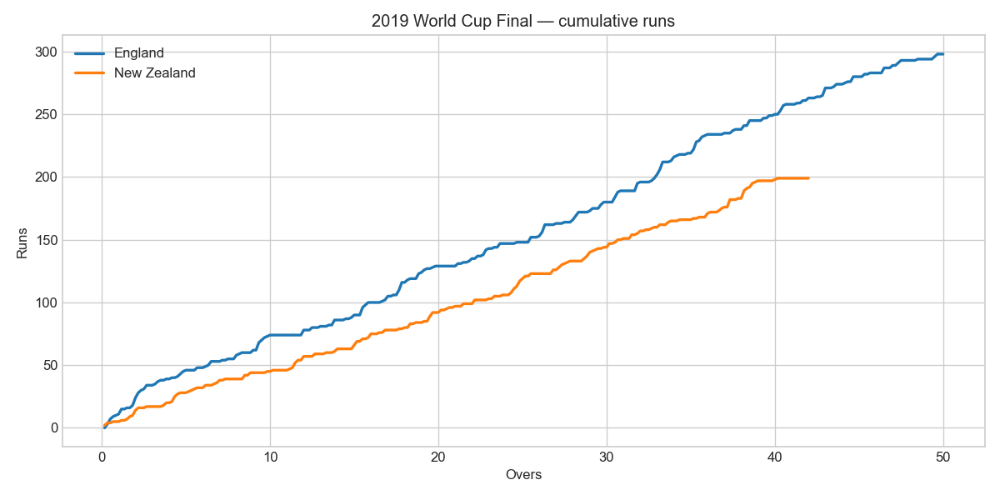
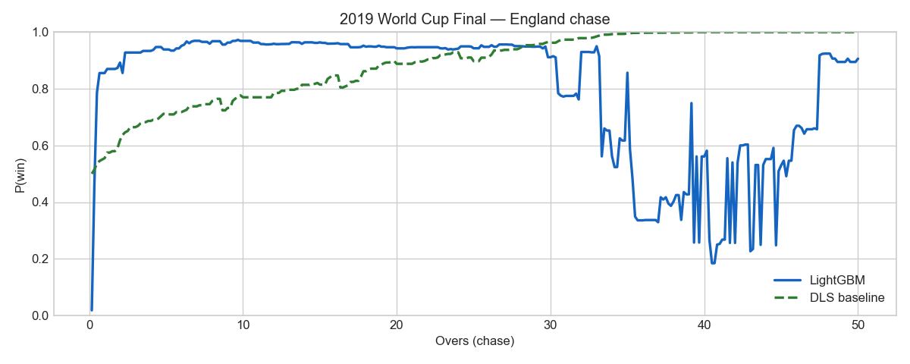
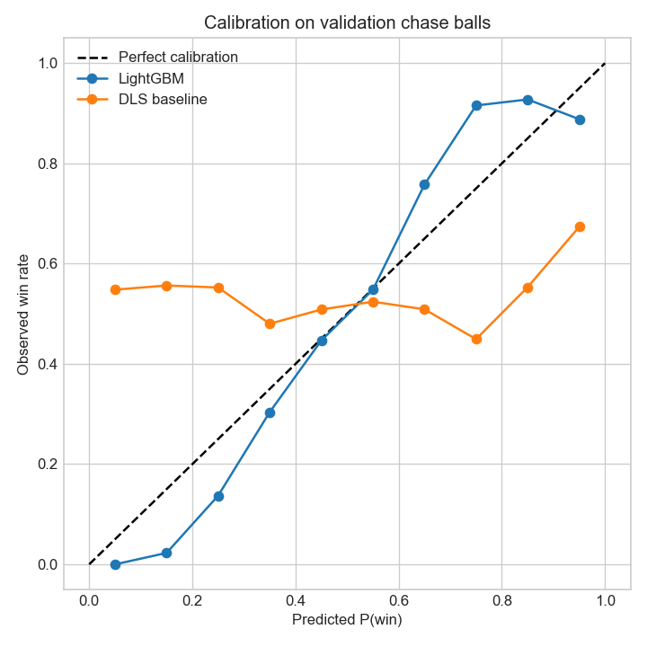

# ODI Win Probability: From DLS to Data

  <h2 style="color: white; margin-top: 0;">Ball-by-ball win probability for one-day cricket</h2>
  
Resource-based baselines and calibrated machine-learning models applied to ODI chases

## Project Overview

Live win-probability gauges have become a staple of cricket broadcasts — but how are those numbers computed? This project walks through the statistical machinery behind **P(batting team wins | current state)** in ODIs, from the resource logic underlying Duckworth–Lewis–Stern (DLS) rain rules to data-driven models trained on ball-by-ball history.

The analysis uses [Cricsheet](https://cricsheet.org/) ODI data parsed into game-state features at every ball of the second innings. A simplified DLS-style resource table provides an interpretable baseline; logistic regression and LightGBM models are trained on historical chases and compared on calibration metrics. Interactive Plotly charts showcase famous World Cup matches.

> **Disclaimer:** The DLS implementation here is an educational approximation — not the ICC-official calculator.

## Project Structure

Six notebooks build the analysis step by step:

  <h3 style="margin-top: 0; color: #1b5e20;">1. Introduction & Data</h3>
  
<strong><a href="01_introduction.html">Explore →</a></strong>

  
ODI scoring, win probability definition, Cricsheet JSON parsing

  <h3 style="margin-top: 0; color: #2e7d32;">2. Game State Features</h3>
  
<strong><a href="02_game_state.html">Explore →</a></strong>

  
RRR, wickets remaining, phase indicators, feature correlations

  <h3 style="margin-top: 0; color: #558b2f;">3. DLS & Resources</h3>
  
<strong><a href="03_dls_resources.html">Explore →</a></strong>

  
Resource tables, par scores, DLS-style win probability baseline

  <h3 style="margin-top: 0; color: #f57f17;">4. Modelling</h3>
  
<strong><a href="04_modelling.html">Explore →</a></strong>

  
Logistic regression, LightGBM, Brier score vs DLS

  <h3 style="margin-top: 0; color: #1565c0;">5. Live Charts</h3>
  
<strong><a href="05_live_charts.html">Explore →</a></strong>

  
Interactive Plotly win-probability lines for famous chases

  <h3 style="margin-top: 0; color: #6a1b9a;">6. Evaluation</h3>
  
<strong><a href="06_evaluation_case_studies.html">Explore →</a></strong>

  
Calibration plots, ML–DLS disagreement, case-study summary

## Key Questions

- When does a chase become statistically unlikely?
- How well does a resource table approximate historical outcomes?
- Does a machine-learning model improve on DLS-style probabilities?
- Which famous chases had the steepest probability swings?

## Preview Figures

## Dataset

- **Primary source:** [Cricsheet ODI ball-by-ball JSON](https://cricsheet.org/)
- **Bundled case studies:** 2019 World Cup Final, 2011 WC QF (India vs Australia), 2011 WC upset (Ireland vs England)
- **Training sample:** 400 ODIs, ~120,000 chase balls (see `data/odi_training_sample.csv`)

## Technical Stack

**Python** • Cricsheet • scikit-learn • LightGBM • Plotly • pandas • Sports Analytics • Calibration

---

  
<strong>Ready to explore?</strong>

  
<a href="01_introduction.html" style="background: #1b5e20; color: white; padding: 0.7em 2em; text-decoration: none; border-radius: 5px; display: inline-block;">Start with Introduction →</a>

