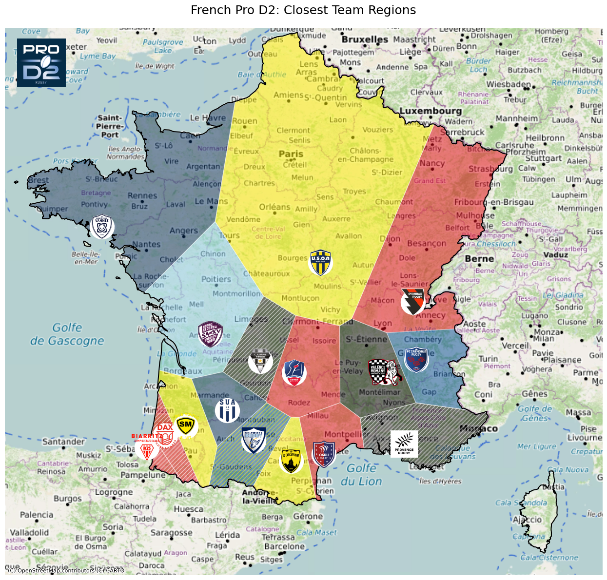

# French Rugby Geographic Analysis: Voronoi Diagrams

## Project Overview

Rugby union is deeply embedded in French culture, particularly in the southwest. This analysis explores the geographic distribution of professional rugby teams across France using Voronoi diagrams to visualize territorial "catchment areas" for Top 14 and Pro D2 clubs.

## Motivation

As a lifelong rugby player and analyst, I wanted to understand:
- Which areas of France are "closest" to each professional rugby club
- How team territories divide the country geographically
- Whether the traditional rugby heartlands in the southwest dominate territorially

## Methodology

This project uses:
- **Geospatial analysis**: Voronoi tessellation to partition France based on proximity to team locations
- **Data visualization**: Interactive and static maps showing team territories
- **Coordinate geometry**: Calculating boundaries between team catchment areas

## Key Findings

The analysis reveals:
- Clear geographic clustering in traditional rugby regions (Occitanie, Nouvelle-Aquitaine)
- Sparse coverage in northern France despite population density
- Territorial dominance by southwestern clubs

## Visualizations

### Top 14 Territories

The premier French rugby league shows strong concentration in the southwest, with teams like Toulouse, Castres, and Montpellier controlling significant territories in the traditional rugby heartland. Each colored region represents the area of France closest to that team's home stadium.

### Pro D2 Territories

The second-tier league also demonstrates southwestern clustering, with additional teams filling gaps in the geographic distribution and creating more granular territorial divisions. The Pro D2 teams complement the Top 14 coverage, particularly in regions with fewer premier league clubs.

## Technical Stack

- **Python**: Core analysis language
- **GeoPandas**: Geospatial data manipulation
- **Shapely**: Geometric operations and Voronoi tessellation
- **Matplotlib/Folium**: Visualization libraries
- **SciPy**: Spatial algorithms

---

**Navigate to the full analysis below** to see the interactive visualizations and methodology.
