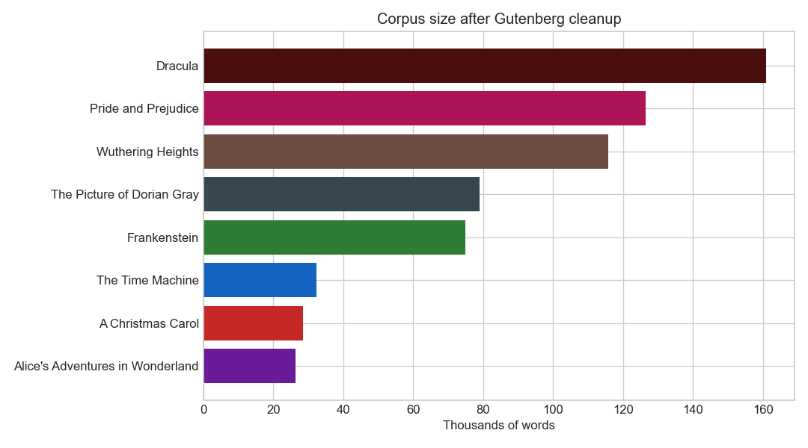
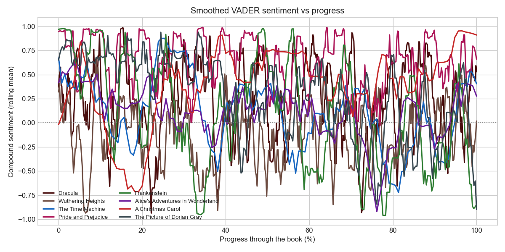
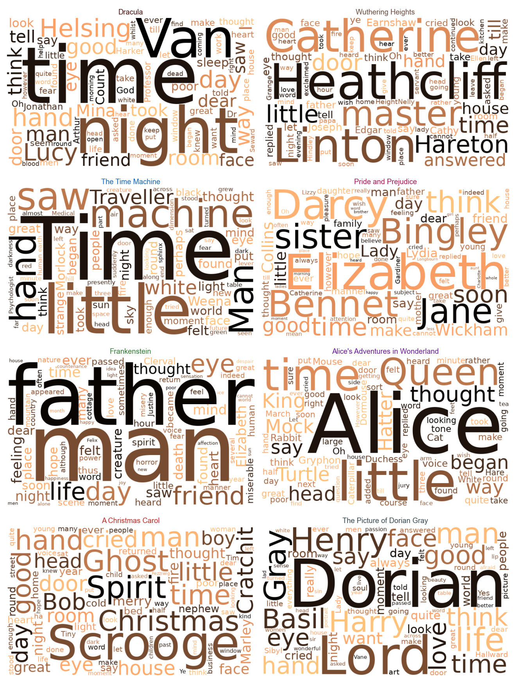

# Literary NLP: Sentiment Across Classic Novels

  <h2 style="color: white; margin-top: 0;">Mapping mood through eight public-domain novels</h2>
  
Sentiment, emotion, vocabulary, and character presence as the plot unfolds

## Project Overview

Do novels darken as they head for the ending, or do they brighten? This project treats classic fiction as a time series: each book is split into page-sized windows of text, then a different NLP technique is applied on each page to watch language and mood change from opening to close.

The corpus is eight well-known public-domain titles from [Project Gutenberg](https://www.gutenberg.org/) — gothic horror, a redemption fable, a marriage plot, and a trip down a rabbit-hole — chosen so the trajectories have something to disagree about.

Lexicon methods (VADER and the NRC emotion lexicon) are used throughout. They are fast, fully reproducible in a Jupyter Book build, and good enough to compare *relative* arcs. They are not a substitute for a literary reading: irony, archaic diction, and free indirect style can fool a word list.

## Project Structure

Six notebooks, each applying one technique to the same eight books:

  <h3 style="margin-top: 0; color: #4a0e0e;">1. Corpus &amp; Cleaning</h3>
  
<strong><a href="01_corpus.html">Explore →</a></strong>

  
Gutenberg texts, boilerplate stripping, page windows, chapter splits

  <h3 style="margin-top: 0; color: #6d4c41;">2. Sentiment Trajectories</h3>
  
<strong><a href="02_sentiment.html">Explore →</a></strong>

  
VADER compound scores vs progress — does the ending darken or brighten?

  <h3 style="margin-top: 0; color: #ad1457;">3. Emotion Lexicon</h3>
  
<strong><a href="03_emotions.html">Explore →</a></strong>

  
NRC joy, fear, sadness, anger, trust, and anticipation through the plot

  <h3 style="margin-top: 0; color: #1565c0;">4. Term Frequency</h3>
  
<strong><a href="04_term_frequency.html">Explore →</a></strong>

  
Keyword trajectories vs page, and TF–IDF distinctive vocabulary

  <h3 style="margin-top: 0; color: #6a1b9a;">5. Word Clouds</h3>
  
<strong><a href="05_wordclouds.html">Explore →</a></strong>

  
Whole-book clouds and beginning / middle / end vocabulary shift

  <h3 style="margin-top: 0; color: #8a7010;">6. Character Presence</h3>
  
<strong><a href="06_characters.html">Explore →</a></strong>

  
Who is on the page as the story moves — mention rates vs progress

## Key Questions

- Which titles become darker in the final third, and which recover?
- Do emotion lexicons pick up gothic fear versus Austenite trust?
- Which words are distinctive to each novel once stopwords are stripped?
- Can character mention-rates reconstruct a plot without reading it?

## Preview Figures

## Dataset

- **Source:** [Project Gutenberg](https://www.gutenberg.org/) plain-text ebooks
- **Titles:** *Dracula*, *Wuthering Heights*, *The Time Machine*, *Pride and Prejudice*, *Frankenstein*, *Alice’s Adventures in Wonderland*, *A Christmas Carol*, *The Picture of Dorian Gray*
- **Unit of analysis:** ~250-word page windows (a Gutenberg file has no printer pagination)
- **Bundled file:** `data/pages.csv` — committed so CI does not fetch Gutenberg at build time

## Technical Stack

**Python** • NLTK (VADER) • NRCLex • scikit-learn (TF–IDF) • wordcloud • Plotly • pandas

---

  
<strong>Ready to explore?</strong>

  
<a href="01_corpus.html" style="background: #4a0e0e; color: white; padding: 0.7em 2em; text-decoration: none; border-radius: 5px; display: inline-block;">Start with the corpus →</a>

