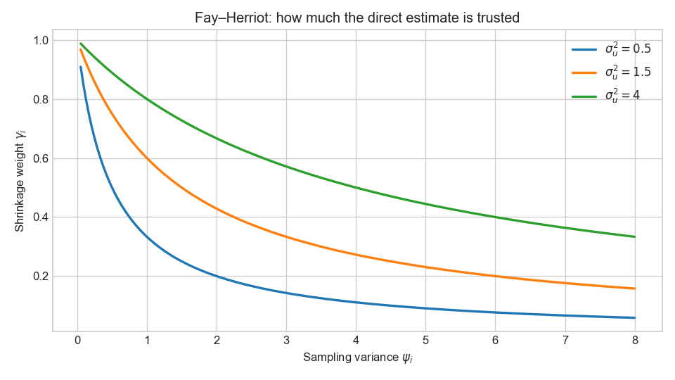
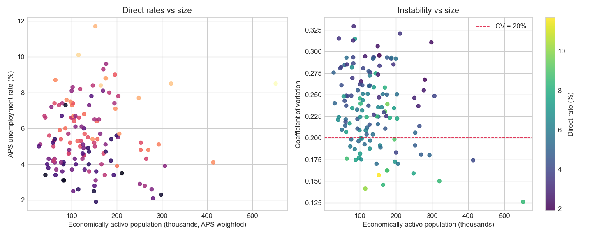
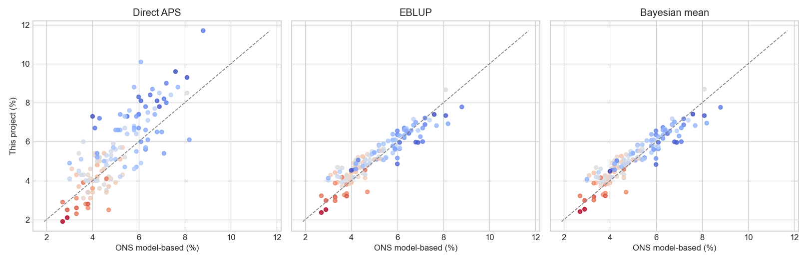

# Small Area Estimation for UK Local Authorities

  <h2 style="color: white; margin-top: 0;">Borrowing strength when the sample runs out</h2>
  
A Fay–Herriot area-level model for APS unemployment rates, compared with ONS’s published model-based estimates

## Project Overview

Direct survey estimates of unemployment become too volatile to publish once the Annual Population Survey is broken down to local authorities: the numerator sample is often a handful of unemployed people. ONS has long addressed this with **model-based estimates** that borrow strength from the claimant count. This project is an open-source reimplementation of that class of model — classical EBLUP and a Bayesian hierarchical version — validated against the Nomis-published official series.

The analysis uses only openly licensed aggregates (no Accredited Researcher / SDS access). Sampling variances $\psi_i$ are recovered from published 95% confidence intervals. The linking model is the textbook Fay–Herriot specification: a linear mean in the claimant-count rate and iid area random effects.

## Project Structure

Six notebooks build the analysis step by step:

  <h3 style="margin-top: 0; color: #0d3b4c;">1. Introduction</h3>
  
<strong><a href="01_introduction.html">Explore →</a></strong>

  
Why direct estimates fail; Fay–Herriot shrinkage; EBLUP vs Bayes

  <h3 style="margin-top: 0; color: #145c69;">2. Data acquisition</h3>
  
<strong><a href="02_data_acquisition.html">Explore →</a></strong>

  
Nomis API: APS rates &amp; CIs, claimant count, ONS model-based series

  <h3 style="margin-top: 0; color: #1a7a7a;">3. Direct estimates</h3>
  
<strong><a href="03_direct_estimates.html">Explore →</a></strong>

  
Construct $y_i$ and $\psi_i$; instability versus area size

  <h3 style="margin-top: 0; color: #2a9d8f;">4. Classical EBLUP</h3>
  
<strong><a href="04_eblup.html">Explore →</a></strong>

  
REML $\sigma_u^2$, Prasad–Rao / Datta–Lahiri MSE, jackknife

  <h3 style="margin-top: 0; color: #1b6b8a;">5. Bayesian FH</h3>
  
<strong><a href="05_bayesian.html">Explore →</a></strong>

  
Gibbs sampler and PyMC NUTS; posterior of $\theta_i$ and $\sigma_u^2$

  <h3 style="margin-top: 0; color: #c45c26;">6. Validation</h3>
  
<strong><a href="06_model_comparison.html">Explore →</a></strong>

  
Direct vs EBLUP vs Bayes vs ONS; choropleths; shrinkage

## Key Questions

- When does the APS local-authority unemployment rate stop being a publication-grade statistic?
- How much should a noisy area shrink toward the claimant-count regression, and does that match ONS?
- Do REML EBLUPs and Bayesian posterior means disagree once $\sigma_u^2$ is uncertain?
- Where do an open Fay–Herriot and the official model-based series diverge — and why might that be expected?

## Preview Figures

## Dataset

- **Direct estimates:** Nomis APS (`NM_17_5`, unemployment rate aged 16–64) with published confidence intervals
- **Benchmark:** Nomis model-based estimates of unemployment (`NM_127_1`)
- **Auxiliary:** Claimant count as % of residents aged 16–64 (`NM_162_1`); APS inactivity as a sensitivity covariate
- **Boundaries:** ONS Open Geography LAD December 2023 BGC
- **Licence:** [Open Government Licence v3.0](https://www.nationalarchives.gov.uk/doc/open-government-licence/version/3/) — see `data/ATTRIBUTION.txt`

Refresh the bundled panel with `python projects/small-area-estimation/_build_data.py`.

## Technical Stack

**Python** • Fay–Herriot • REML EBLUP • PyMC • Nomis API • geopandas • Plotly • Official Statistics

---

  
<strong>Ready to explore?</strong>

  
<a href="01_introduction.html" style="background: #0d3b4c; color: white; padding: 0.7em 2em; text-decoration: none; border-radius: 5px; display: inline-block;">Start with Introduction →</a>

