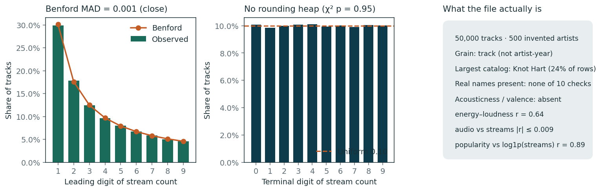
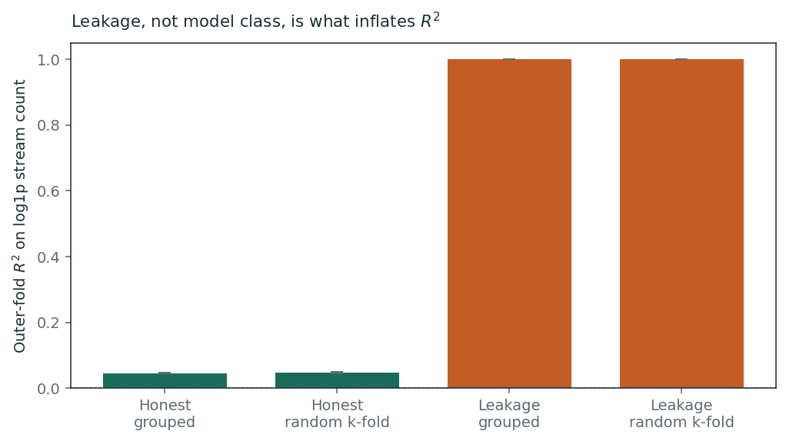
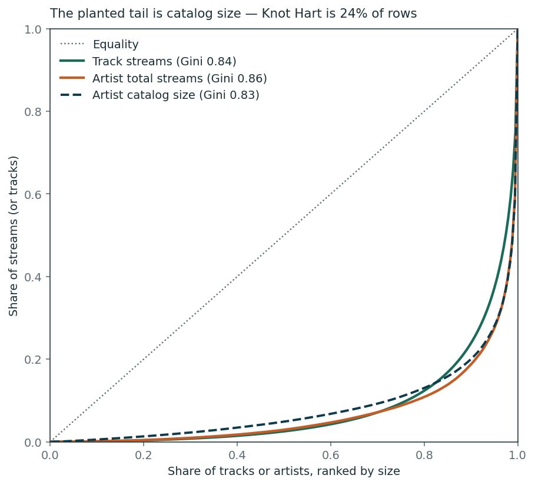

# Power Laws and Popularity

  <h2 style="color: white; margin-top: 0;">What 500 artists can and cannot tell you about streaming success</h2>
  
A synthetic Spotify catalog, treated as a small-<em>n</em> inference problem wearing an ML costume

<strong>Synthetic data.</strong> The Kaggle file is a 50,000-row track table with 500 invented artist names. The publisher states that no Spotify API data were used. Nothing below is a claim about the streaming industry.

## Project Overview

Kaggle will sell you 50,000 rows and 33 columns of "Spotify artist streaming analytics, 2020–2025". That looks like a machine-learning problem. It is not. After a schema check the grain is **track**, not artist-year; the names are generated; audio features are orthogonal to streams; and popularity is almost `log1p` of the target. The interesting work is estimand definition, a leakage audit, validation that matches the clustering, and stopping when extra model capacity stops paying.

The honest conclusion is the one worth publishing: **flexible models buy nothing at this generating process, leaked features buy \(R^2 = 1\), and the planted superstar tail is catalog size rather than quality.**

## The page

One executable chapter. Code lives in `src/spotify_powerlaws/` and numbered scripts; the notebook loads artifacts.

  <h3 style="margin-top: 0; color: #0d3b4c;">Analysis</h3>
  
<strong><a href="01_analysis.html">Read the page →</a></strong>

  
Forensics, estimand, grouped CV, model ladder, power-law tests, conformal coverage

## Key questions

- Is this an artist panel, a track catalog, or a synthetic script with a Spotify costume?
- Which columns are antecedent to streams, and which are the target in disguise?
- Does grouped-by-artist CV change the honest model — or only fail to save a tautological one?
- When does added capacity stop paying, and does partial pooling find artist effects the ANOVA already said were zero?

## Preview figures

## Dataset

- **Source:** [Kaggle: Spotify Artist Streaming Analytics 2020–2025](https://www.kaggle.com/datasets/beamhonor0911/spotify-artist-streaming-analytics-20202025) (CC BY 4.0)
- **File:** 50,000 tracks × 33 columns; 500 invented artists
- **Grain:** track (`track_id` unique). Not artist-year, not a listening panel
- **Rebuild:** `make download` writes `data/raw/` (gitignored). SHA-256 in `artifacts/download.json`
- **This site:** notebooks read committed `artifacts/` and `figures/` only

## Technical stack

**Python** • pandas • scikit-learn • statsmodels MixedLM • matplotlib • scipy

Pipeline: `projects/spotify-power-laws/Makefile` (`00_download.py` … `08_figures.py`)

---

  
<strong>Start with the forensics.</strong>

  
<a href="01_analysis.html" style="background: #0d3b4c; color: white; padding: 0.7em 2em; text-decoration: none; border-radius: 5px; display: inline-block;">Open the analysis →</a>

