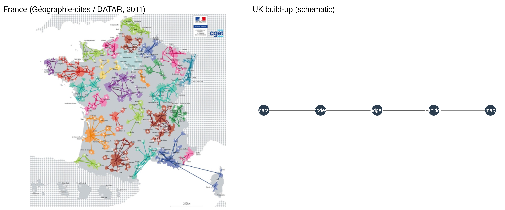
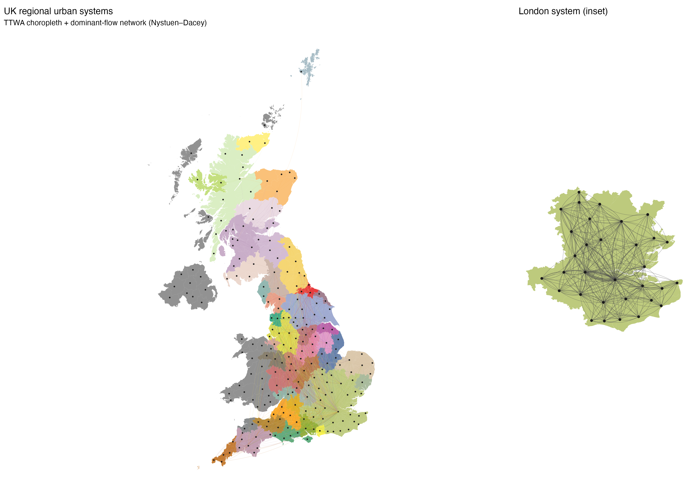

# UK Urban Systems Network

<div style="background: linear-gradient(135deg, #2c3e50 0%, #4a6741 100%); color: white; padding: 2em; border-radius: 10px; margin: 2em 0; text-align: center;">
  <h2 style="color: white; margin-top: 0;">Regional urban systems from commuting flows</h2>
  <p style="font-size: 1.1em; margin-bottom: 0;">A UK replication of the French <em>systèmes urbains régionaux</em> cartogram (Géographie-cités / DATAR, 2011)</p>
</div>

## Project overview

This project builds a spatially embedded network of UK functional urban areas, linked by preferential commuting and economic ties, and partitioned into regional urban systems using the Nystuen–Dacey dominant-flow algorithm. The narrative walks through the map incrementally: from raw census and boundary data to nodes, edges, regional partitions, and a final styled cartogram with choropleth fill and a London inset—mirroring the treatment of Paris in the original French map.

The methodology is deliberately aligned with the Géographie-cités / DATAR (2011) approach[^datar]: nodes are Travel to Work Areas (TTWAs, 2011 definition), edges aggregate workplace-to-residence flows, and regional colours mark dominant-flow partitions—not modularity clustering.

[^datar]: Géographie-cités & DATAR (2011). *Les systèmes urbains régionaux* — cartogram of 26 regional urban systems in France.

## Motivation

France’s 2011 cartogram showed how 26 *systèmes urbains régionaux* emerge from everyday mobility: each node is a functional urban area, each edge a preferential link, and each colour a nodal region defined by the largest outward commuting tie. The UK has comparable TTWA geography and rich census OD data, making a British replication a natural extension of that work—while keeping the same Route B partition logic (Nystuen–Dacey) rather than community-detection shortcuts.

## Methodology summary

- **Nodes:** TTWAs (2011 definition), boundaries from the ONS Open Geography Portal (UK-wide, including Wales and Scotland).
- **Edges (England & Wales):** Census **2021** MSOA workplace flows (`ODWP01EW`), aggregated to TTWA via a UK MSOA→TTWA lookup.
- **Edges (Scotland):** Census **2022** Intermediate Zone workplace flows, aggregated to TTWA via the 2011 Data Zone lookup.
- **Census caveat:** This is a comparative UK map, not a single harmonised census product—EW 2021 and Scotland 2022 are combined on 2011 TTWA geography.
- **Partition:** Nystuen–Dacey dominant-flow / nodal regions—implemented explicitly in R; no `cluster_louvain` or `cluster_infomap`.
- **Maps:** Static PNG figures plus **interactive Leaflet** widgets in chapters 06 and 07 (pan/zoom, TTWA popups, country layer toggles).

## Preview figures





## Project structure

Seven notebooks build the map step by step:

<div style="display: grid; grid-template-columns: repeat(auto-fit, minmax(260px, 1fr)); gap: 1.5em; margin: 2em 0;">

<div style="background: #f8f9fa; padding: 1.5em; border-radius: 8px; border-left: 4px solid #2c3e50;">
  <h3 style="margin-top: 0; color: #2c3e50;">1. Introduction</h3>
  <p style="margin-bottom: 0.5em;"><strong><a href="01_introduction.html">Explore →</a></strong></p>
  <p style="font-size: 0.9em; color: #666; margin: 0;">French inspiration, UK pipeline overview, side-by-side schematic</p>
</div>

<div style="background: #f8f9fa; padding: 1.5em; border-radius: 8px; border-left: 4px solid #4a6741;">
  <h3 style="margin-top: 0; color: #4a6741;">2. Data acquisition</h3>
  <p style="margin-bottom: 0.5em;"><strong><a href="02_data_acquisition.html">Explore →</a></strong></p>
  <p style="font-size: 0.9em; color: #666; margin: 0;">UK TTWA boundaries, EW 2021 + Scotland 2022 OD flows</p>
</div>

<div style="background: #f8f9fa; padding: 1.5em; border-radius: 8px; border-left: 4px solid #6b8e6b;">
  <h3 style="margin-top: 0; color: #6b8e6b;">3. Data cleaning</h3>
  <p style="margin-bottom: 0.5em;"><strong><a href="03_data_cleaning.html">Explore →</a></strong></p>
  <p style="font-size: 0.9em; color: #666; margin: 0;">MSOA/IZ→TTWA aggregation, edge filtering, centroids</p>
</div>

<div style="background: #f8f9fa; padding: 1.5em; border-radius: 8px; border-left: 4px solid #8b7355;">
  <h3 style="margin-top: 0; color: #8b7355;">4. Nodes</h3>
  <p style="margin-bottom: 0.5em;"><strong><a href="04_nodes.html">Explore →</a></strong></p>
  <p style="font-size: 0.9em; color: #666; margin: 0;">TTWA centroids scaled by working-age population</p>
</div>

<div style="background: #f8f9fa; padding: 1.5em; border-radius: 8px; border-left: 4px solid #5d6d7e;">
  <h3 style="margin-top: 0; color: #5d6d7e;">5. Flows</h3>
  <p style="margin-bottom: 0.5em;"><strong><a href="05_flows.html">Explore →</a></strong></p>
  <p style="font-size: 0.9em; color: #666; margin: 0;">Monochrome network edges weighted by flow volume</p>
</div>

<div style="background: #f8f9fa; padding: 1.5em; border-radius: 8px; border-left: 4px solid #7d6608;">
  <h3 style="margin-top: 0; color: #7d6608;">6. Partition</h3>
  <p style="margin-bottom: 0.5em;"><strong><a href="06_partition.html">Explore →</a></strong></p>
  <p style="font-size: 0.9em; color: #666; margin: 0;">Nystuen–Dacey regions + interactive Leaflet map</p>
</div>

<div style="background: #f8f9fa; padding: 1.5em; border-radius: 8px; border-left: 4px solid #1a5276;">
  <h3 style="margin-top: 0; color: #1a5276;">7. Final map</h3>
  <p style="margin-bottom: 0.5em;"><strong><a href="07_final_map.html">Explore →</a></strong></p>
  <p style="font-size: 0.9em; color: #666; margin: 0;">Choropleth cartogram, London inset, interactive Leaflet</p>
</div>

</div>

## Key technologies

| Package | Role |
|---------|------|
| **tidyverse** / **data.table** | Data wrangling and tables |
| **sf** | Simple features for boundaries and centroids |
| **httr2** / **readxl** | Download and parse Scotland OD Excel |
| **sfnetworks** / **tidygraph** / **igraph** | Spatial network construction |
| **ggraph** | Network plotting |
| **ggplot2** / **patchwork** | Static cartogram + London inset |
| **leaflet** / **htmlwidgets** / **IRdisplay** | Interactive maps embedded in the book |
| **here** | Reproducible paths from the repo root |

Kernel: **IRkernel** (R). Install dependencies via [`r-requirements.R`](r-requirements.R).

Refresh cached data and RDS outputs:

```bash
Rscript projects/uk-urban-systems-network/scripts/fetch_live_data.R
Rscript projects/uk-urban-systems-network/scripts/run_pipeline.R
```

## Data sources

| Source | Role |
|--------|------|
| **ONS Open Geography Portal** | TTWA boundaries (2011, UK), MSOA/LSOA/TTWA lookups |
| **NOMIS / Census 2021** | England & Wales MSOA workplace OD (`ODWP01EW`) |
| **Scotland’s Census 2022** | IZ workplace OD (Part 6, Table 6b) |
| **statistics.gov.scot** | Data Zone 2011 lookup (IZ → TTWA) |
| **Géographie-cités / DATAR (2011)** | Conceptual and visual reference cartogram |

See [Data acquisition](02_data_acquisition.md) for download paths and ingest details. Place the French reference image at `_static/uk-urban-systems-network/french_datar_2011.png` before building chapter 01.

Interactive map HTML is written to `_static/uk-urban-systems-network/maps/` when notebooks 06–07 run (gitignored; rebuilt on CI).

---

<div style="text-align: center; margin: 2em 0; padding: 1.5em; background: #f0f0f0; border-radius: 8px;">
  <p style="font-size: 1.2em; margin: 0;"><strong>Ready to explore?</strong></p>
  <p style="margin: 0.5em 0 0 0;"><a href="01_introduction.html" style="background: #2c3e50; color: white; padding: 0.7em 2em; text-decoration: none; border-radius: 5px; display: inline-block;">Start with the introduction →</a></p>
</div>
